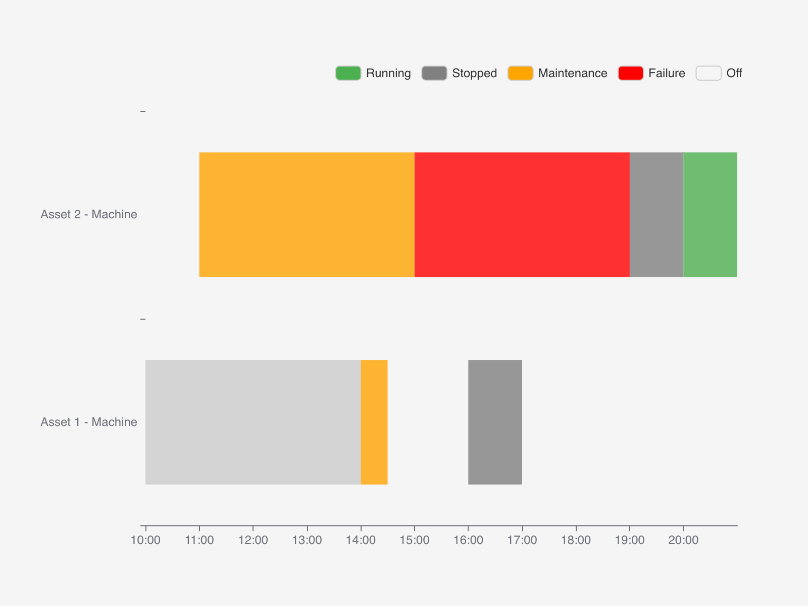

# \<widget-statehistory>



<br>

# The usage

## Installation & Usage

```bash
npm i widget-statehistory
```

```html
<script type="module">
    import 'widget-statehistory'
</script>

<widget-statehistory-1.0.12 inputData="default-data"></widget-statehistory-1.0.12>
```

## Development

> Make sure to always keep the widget tag name in sync with the version string in the package.json. i.e in `demo/index.html` you need to replace the version string here. `<widget-statehistory-1.0.12>`

To use the widget locally during development clone the widget repo and start the dev server:

```bash
npm run start
```

This runs a local development server that serves the basic demo located in `demo/index.html`

If you want to use the widget inside another project X, then add the widget as npm module to the project X as usual. i.e. in the folder of X

```bash
npm i widget-statehistory
```

To avoid releasing the widget-statehistory on every change and updating the node_modules in your project X you can "link" the package locally. This replaces the already imported widget-statehistory package with your local widget-statehistory git repo. Since this node module is linked all changes you make in your local widget-statehistory repo will immediately be visible in project X.

Go to your local widget-statehistory git repo and do

```bash
npm run link
```

This create a global symbolic link on your environment and links your local package into the project X folder. (You may need to adjust the project X folder in your package.json) To reinstall the original npm version of the widget do

```bash
npm run unlink
```

<br>
<br>

## Releasing a new version

To release a new version of the widget commit all your changes and run

```js
npm run types
npm run release
```

Note that `npm run release` automatically increases the path version number. If you want a minor update, then either adjuste the version in the package.json manually or use `minor` instead of `patch` in the `npm run release` command.

After the version tag has been successfully published to github, our github action kicks in and creates a release on github and publishes the release on npm as well.

Now you need to tell the IronFlock system that a new version of the widget should be offered. You do this by executing with the new version string you created.

```sql
select swarm.f_update_widget_master('{"package_name": "widget-statehistory", "version": "1.0.12"}'::jsonb);
```

To make it work locally you need to `npm run build` to get the correct version string in your build files locally, then restart the node web server container.

> It the widget is part of the demo dashboard-template.yml, then also adjust the version numbers there!
